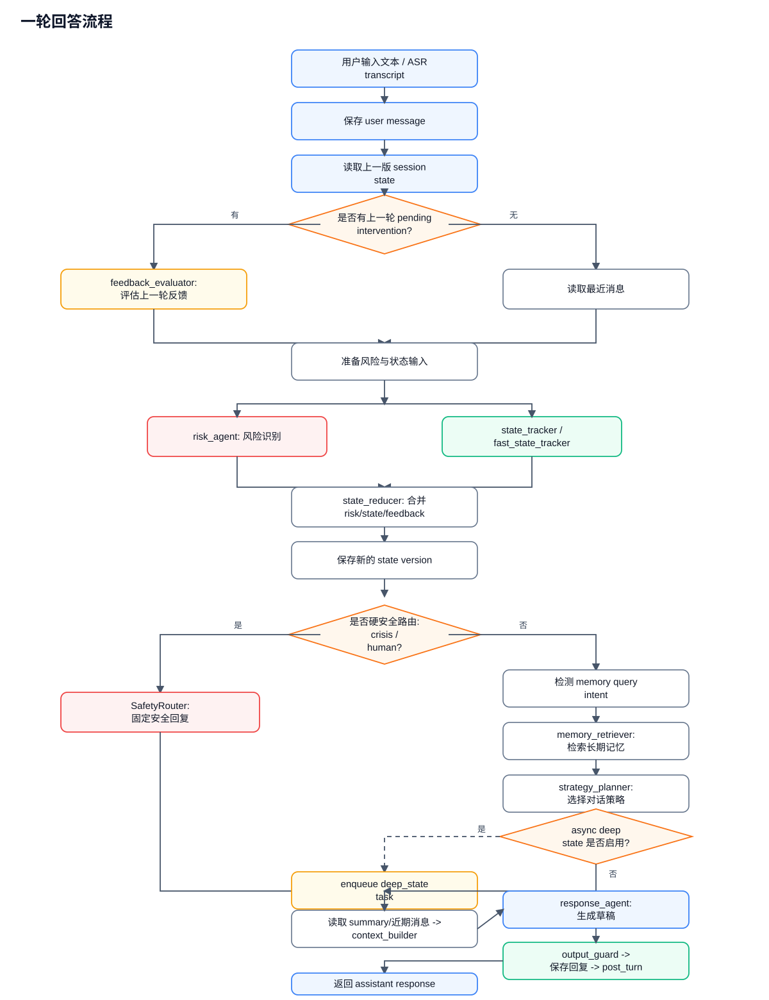
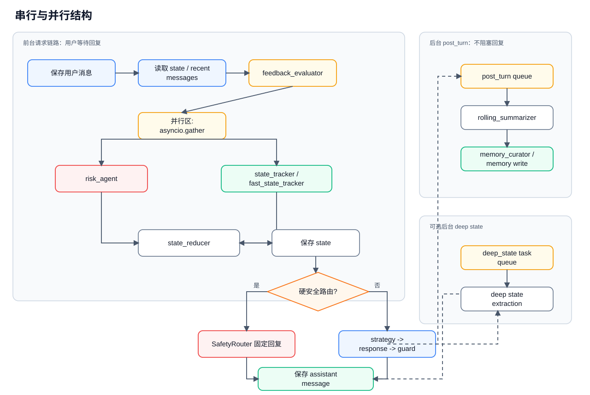
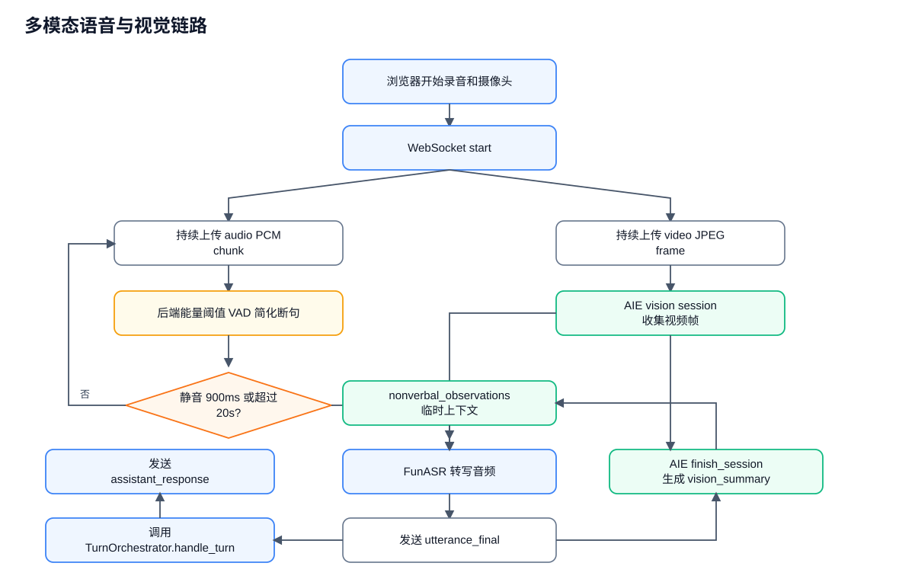

# 当前语音/视觉心理支持 Agent 交接说明

更新日期：2026-08-11

这份文档描述当前 `psych-agent_v4` 的运行结构、主要功能、模型/提示词位置、串并行安排，以及一轮回答是如何流过各个 agent 的。更完整的历史设计可参考 `docs/system_design.md`、`docs/code_architecture.md`、`docs/runtime_modes.md`、`docs/multi_model_routing.md`、`docs/v3_async_state_pipeline_changes.md`。

## 1. 总体入口

当前对外主要有两种交互入口：

| 入口 | 路径 | 说明 |
| --- | --- | --- |
| 文本聊天 | `POST /chat/turn` | 旧文本接口，仍保留可用。 |
| 语音+摄像头 | `WS /multimodal/ws` | 浏览器上传 PCM 音频 chunk 和 JPEG 视频帧；后端断句、ASR、视觉统计，再调用 agent。 |
| 会话历史 | `GET /sessions`、`GET /sessions/{session_id}/messages` | 前端左侧历史会话列表和旧消息读取。 |
| 长期记忆 | `GET /users/{user_id}/memories`、`POST confirm`、`DELETE` | 前端长期记忆面板读取、确认、软删除。 |
| 记忆开关 | `GET/PUT /users/{user_id}/memory` | 用户长期记忆写入开关。 |
| 归档总结 | `POST /sessions/close` | 前端“归档并总结”，生成最终总结和收尾记忆整理。 |

前端文件：

- `web/index.html`
- `web/app.js`
- `web/styles.css`

前端已经从单一当前会话改成对话工作台：左侧有历史会话、长期记忆；主区域保留语音+摄像头输入。归档后的会话只读，不能继续录音发送。

## 2. 模型与提示词

模型选择由 `app/config.py` 的 `Settings.agent_model_names()` 统一解析。服务器当前 `.env` 的核心配置是：

```env
LLM_MODEL_ROUTES={"Qwen3.5-0.8B-Base":"http://127.0.0.1:8002/v1","Qwen3.6-27B":"http://127.0.0.1:8001/v1"}
MAIN_MODEL_NAME=Qwen3.6-27B
STRUCTURED_MODEL_NAME=Qwen3.5-0.8B-Base
SAFETY_MODEL_NAME=Qwen3.5-0.8B-Base
RESPONSE_MODEL_NAME=Qwen3.6-27B
OUTPUT_GUARD_MODEL_NAME=Qwen3.6-27B
```

当前实际模型分配：

| 功能 | Agent/服务 | 当前模型 | 服务地址 | 提示词 |
| --- | --- | --- | --- | --- |
| 风险识别 | `agents/risk_agent.py` | `Qwen3.5-0.8B-Base` | `http://127.0.0.1:8002/v1` | `prompts/risk_agent.md` |
| 状态更新 | `agents/state_tracker.py` | `Qwen3.5-0.8B-Base` | `http://127.0.0.1:8002/v1` | `prompts/state_tracker.md` |
| 反馈评估 | `agents/feedback_evaluator.py` | `Qwen3.5-0.8B-Base` | `http://127.0.0.1:8002/v1` | `prompts/feedback_evaluator.md` |
| 策略选择 | `agents/strategy_planner.py` | `Qwen3.5-0.8B-Base` | `http://127.0.0.1:8002/v1` | `prompts/strategy_planner.md` |
| 回复生成 | `agents/response_agent.py` | `Qwen3.6-27B` | `http://127.0.0.1:8001/v1` | `prompts/response_agent.md` |
| 输出检查 | `agents/output_guard.py` | `Qwen3.6-27B` | `http://127.0.0.1:8001/v1` | `prompts/output_guard.md` |
| 滚动总结 | `agents/rolling_summarizer.py` | `Qwen3.5-0.8B-Base` | `http://127.0.0.1:8002/v1` | `prompts/rolling_summarizer.md` |
| 会话收尾 | `agents/session_finalizer.py` | `Qwen3.5-0.8B-Base` | `http://127.0.0.1:8002/v1` | `prompts/session_finalizer.md` |
| 长期记忆候选 | `agents/memory_curator.py` | `Qwen3.5-0.8B-Base` | `http://127.0.0.1:8002/v1` | `prompts/memory_curator.md` |
| ASR | `services/funasr_transcriber.py` | FunASR `iic/speech_paraformer-large_asr_nat-zh-cn-16k-common-vocab8404-pytorch` | 本进程懒加载 | 无 prompt |
| 视觉情绪/AU | AIE service | AIE_SERVER 的 AU/情绪模型 | `http://127.0.0.1:8770` | 无 prompt |

如果某个 `*_MODEL_NAME` 没有单独设置，会按 `Settings.agent_model_names()` 回退：风险和 guard 默认走 `SAFETY_MODEL_NAME`，回复默认走 `MAIN_MODEL_NAME`，其他结构化任务默认走 `STRUCTURED_MODEL_NAME`。

系统级回复边界：

- `prompts/system/product_boundary.md`
- `prompts/system/response_policy.md`

vLLM 启动脚本：

- `vllm27B.sh`：默认 `TENSOR_PARALLEL_SIZE=4`，监听 `8001`。
- `vllm0.8B.sh`：默认 `TENSOR_PARALLEL_SIZE=2`，监听 `8002`。

## 3. 多模态输入实现

核心文件：

- `api/routers/multimodal.py`
- `services/funasr_transcriber.py`
- `services/aie_vision_client.py`

浏览器发送协议：

```json
{"type":"start","user_id":"1","session_id":"session-1"}
{"type":"audio","sample_rate":16000,"pcm16_base64":"...","timestamp_ms":12345}
{"type":"video_frame","format":"jpeg","image_base64":"...","timestamp_ms":12345}
{"type":"stop"}
```

服务端返回：

```json
{"type":"listening"}
{"type":"utterance_final","transcript":"我今天有点累"}
{"type":"vision_summary","summary":{}}
{"type":"assistant_response","response":"...","state_version":3}
{"type":"error","message":"..."}
```

当前断句参数在 `app/config.py`：

- `MULTIMODAL_SILENCE_MS=900`
- `MULTIMODAL_MIN_SPEECH_MS=600`
- `MULTIMODAL_MAX_UTTERANCE_MS=20000`
- `MULTIMODAL_RMS_THRESHOLD=350`
- `AIE_VISION_URL=http://127.0.0.1:8770`

注意：浏览器摄像头/麦克风需要安全上下文。公网 `http://111.56.189.29:8020/` 可能无法使用 `getUserMedia`；测试时推荐 SSH 隧道后打开 `http://localhost:8020/`。

```bash
ssh -L 8020:127.0.0.1:8020 root@111.56.189.29
```

## 4. 一轮回答流程

主流程在 `orchestrator/turn_orchestrator.py` 的 `TurnOrchestrator.handle_turn()`。

一轮回答流程图：



文字版顺序：

```text
用户输入文本
-> 保存 user message
-> 读取上一版 session state
-> 如有上一轮 pending intervention，运行 feedback_evaluator
-> 读取最近消息
-> risk_agent 与 state_tracker/fast_state_tracker 并行运行
-> reducer 合并 risk/state/feedback，保存新 state version
-> 如果是硬安全路由 crisis/human，返回固定安全回复
-> 检测用户是否在询问长期记忆
-> 检索长期记忆
-> strategy_planner 选择回复策略
-> 如开启 async deep state，后台排入 deep state task
-> 读取 rolling summary 和近期消息
-> context_builder 组装 response context
-> response_agent 生成草稿
-> output_guard 审查草稿
-> 保存 assistant message
-> 保存 pending intervention，供下一轮 feedback_evaluator 使用
-> enqueue post_turn 后台任务
-> 返回 assistant response
```

### risk agent 在哪里

- 实现：`agents/risk_agent.py`
- Prompt：`prompts/risk_agent.md`
- 调用位置：`orchestrator/turn_orchestrator.py`，与 state tracker 并行。

当前安全策略：

- `crisis_protocol` / `human_escalation`：硬安全路由，会返回固定安全回复。
- `safety_clarification`：不再硬拦截，归一到普通回复链路，避免普通聊天被卡住。
- 风险关键词兜底只看当前用户消息，不再扫 assistant 历史安全文案，避免“安全回复触发安全回复”的循环。

### loop 在哪里

这里的 loop 主要是“策略-反馈-调整”闭环：

1. 每轮回复后，`TurnOrchestrator` 保存一个 pending intervention。
2. 下一轮用户消息进来时，`feedback_evaluator` 会评估用户对上一轮干预是否接受/拒绝/无反馈。
3. `strategy_planner` 根据 feedback、state、memory、risk 决定下一轮策略。
4. 新策略再影响 `response_agent` 的回复。

相关文件：

- `orchestrator/turn_orchestrator.py`
- `agents/feedback_evaluator.py`
- `agents/strategy_planner.py`
- `storage/repositories/intervention_repository.py`
- `schemas/intervention.py`

## 5. 串行与并行结构

### 主回复链路

串并行结构图：



| 阶段 | 串/并行 | 说明 |
| --- | --- | --- |
| 保存用户消息、读取历史状态 | 串行 | DB 操作，保证顺序。 |
| feedback_evaluator | 串行 | 依赖上一轮 pending intervention。 |
| risk_agent + state_tracker/fast_state_tracker | 并行 | `asyncio.gather()`，阶段名 `agents.risk_state_parallel`。 |
| state reduce/save | 串行 | 需要 risk 和 state delta 都完成。 |
| memory retrieve -> strategy -> context -> response -> guard | 串行 | 后一步依赖前一步结果。 |
| deep state | 后台并行 | 仅在 `ASYNC_STATE_PIPELINE_ENABLED=true` 时启用。 |
| post_turn | 后台 | 主回复返回后执行，不阻塞用户看到回复。 |

### 多模态链路

当前 `WS /multimodal/ws` 在一句话结束后的处理图：



音频和视频是流式上传的，但最终处理时 ASR 和视觉汇总目前是串行：

```text
ASR -> vision_summary -> agent_turn
```

后续可以优化为 ASR 与 `vision_client.finish_session()` 并行，因为二者互不依赖。

### post_turn 后台任务

核心文件：

- `orchestrator/post_turn_pipeline.py`
- `workers/post_turn_worker.py`
- `workers/post_turn_memory_worker.py`
- `runtime/factory.py`

触发时机：一轮回复保存并提交后。

```text
assistant response 已保存
-> transaction commit
-> BackgroundPostTurnTaskQueue.enqueue("post_turn")
-> 后台执行 rolling summary
-> 后台执行 lightweight memory curation
```

同一个 session 的 post-turn 会加锁串行，避免总结和记忆乱序；不同 session 的后台任务可以并发。

如果开启 async deep state，post-turn 会先等待同 session 的 deep state task 完成，再做 summary/memory。

## 6. 长期记忆实现

核心文件：

- `workers/post_turn_memory_worker.py`
- `workers/memory_worker.py`
- `agents/memory_curator.py`
- `services/memory_policy.py`
- `storage/repositories/memory_repository.py`
- `api/routers/users.py`

写入机会：

1. 每轮 post_turn：只写低敏、明确用户陈述、高置信度的可复用信息。
2. 归档并总结：通过 session finalizer 做最终总结和收尾整理。

不会自动写入：

- 中高敏信息
- 低置信度候选
- session summary 自己推断出的内容
- 模型推断
- 视觉情绪/AU 结果

视觉信息只作为当前轮 `nonverbal_observations` 传入 context，不进入 `messages` 或 `long_term_memories`。

用户可通过前端长期记忆面板查看、确认 pending、软删除记忆。

## 7. 会话管理

核心文件：

- `api/routers/sessions.py`
- `storage/repositories/session_repository.py`
- `storage/repositories/message_repository.py`
- `web/app.js`

行为：

- “新会话”只切换到新 active session，不关闭旧 session。
- 历史会话可点击加载消息。
- “归档并总结”调用 `POST /sessions/close`。
- 已归档 session 只读，前端禁用开始说话。

## 8. 服务启动与健康检查

AIE：

```bash
conda activate aie
cd /data/agent/psych-agent/psych-agent_v4/AIE_SERVER
python -m uvicorn api.vision_service:app --host 127.0.0.1 --port 8770
```

Agent：

```bash
conda activate agent
cd /data/agent/psych-agent/psych-agent_v4
python -m uvicorn app.main:app --host 0.0.0.0 --port 8020
```

vLLM：

```bash
cd /data/agent/psych-agent/psych-agent_v4
bash vllm27B.sh
```

健康检查：

```bash
curl http://127.0.0.1:8020/health
curl http://127.0.0.1:8020/health/ready
curl http://127.0.0.1:8001/v1/models -H "Authorization: Bearer $LLM_API_KEY"
```

`/health` 只表示 agent 进程活着；`/health/ready` 会检查 database、redis、llm。Redis 当前不是必需，`not_configured` 不影响 ready。

## 9. 最近几个重要修复

- 长期记忆改为每轮 post_turn 后台轻量写入，不再只依赖关闭会话。
- 新增会话历史与长期记忆管理前端。
- WebSocket 发送改为 safe send，浏览器断开后不会再触发 ASGI `websocket.close` 后继续 send 的异常。
- 风险逻辑降低误报：模型失败无关键词时不触发安全澄清；历史 assistant 安全文案不会反复触发风险。
- 软风险不再阻断对话；只有 crisis/human escalation 走硬安全回复。

## 10. 交接时优先看的文件

| 想了解什么 | 优先看 |
| --- | --- |
| 一轮回答怎么跑 | `orchestrator/turn_orchestrator.py` |
| 真实模型如何接入 | `runtime/factory.py`、`llm/routed_client.py`、`llm/local_client.py` |
| 模型名和服务地址 | `app/config.py`、服务器 `.env` |
| 风险判断 | `agents/risk_agent.py`、`prompts/risk_agent.md` |
| 回复生成 | `agents/response_agent.py`、`prompts/response_agent.md` |
| 输出安全检查 | `agents/output_guard.py`、`prompts/output_guard.md` |
| ASR 和摄像头情绪 | `api/routers/multimodal.py`、`services/funasr_transcriber.py`、`services/aie_vision_client.py` |
| 长期记忆 | `workers/post_turn_memory_worker.py`、`agents/memory_curator.py`、`services/memory_policy.py` |
| 会话历史/归档 | `api/routers/sessions.py`、`runtime/sqlalchemy_session_closer.py` |
| 前端工作台 | `web/app.js`、`web/index.html`、`web/styles.css` |
